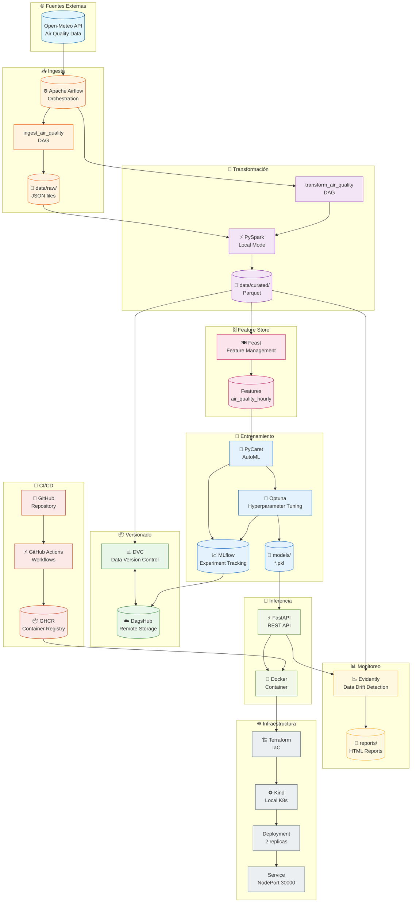
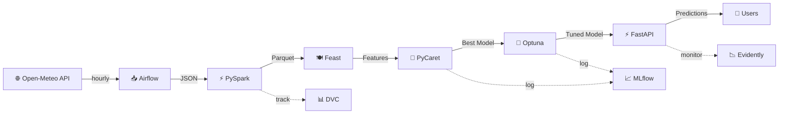
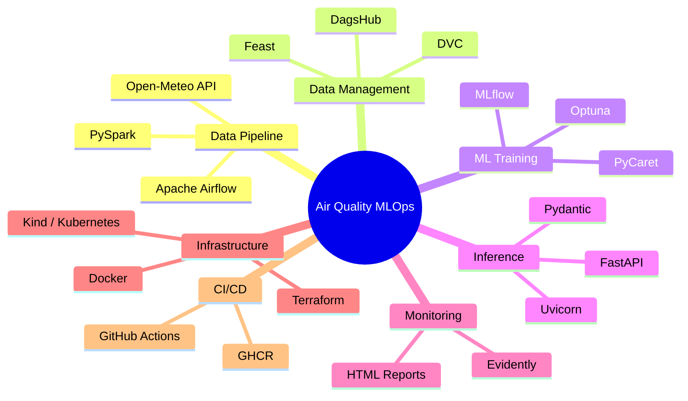
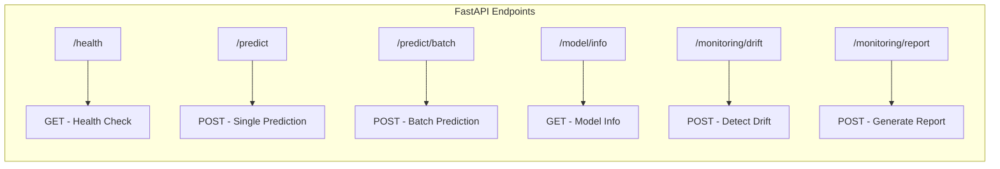

# 🏗️ Arquitectura del Sistema

## Diagrama General

## Flujo de Datos Simplificado

## Stack Tecnológico

## Componentes y Puertos

| Servicio | Puerto Local | Descripción |
|----------|--------------|-------------|
| Airflow UI | 8080 | Orquestación de pipelines |
| FastAPI (Docker) | 8000 | API de inferencia |
| FastAPI (K8s) | 8080 | API en Kubernetes |
| MLflow | DagsHub | Tracking de experimentos |
| Feast | SQLite | Feature store local |

## Endpoints de la API

